# Campfire — Feature Walkthrough

Campfire is a private planning app for friend groups who game together. It helps you coordinate who's free, decide what to play, schedule sessions, and keep the conversation in one place.

---

## The Feed

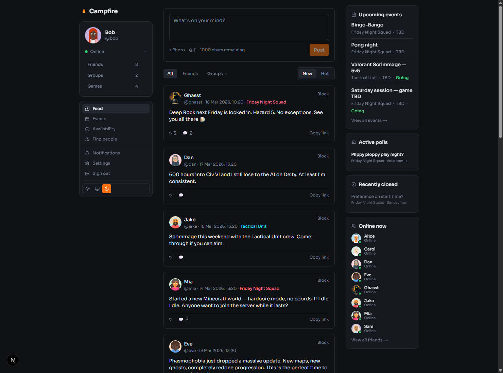

Your feed is home base. Posts from your friends and groups show up here, and a persistent right panel keeps you across upcoming events, active polls, and who's online right now — so you never miss anything important.

You can write a post, attach photos or GIFs, and embed YouTube links directly. Posts tied to a specific session or group appear with a group badge and an event link so context is always one click away.

---

## Groups

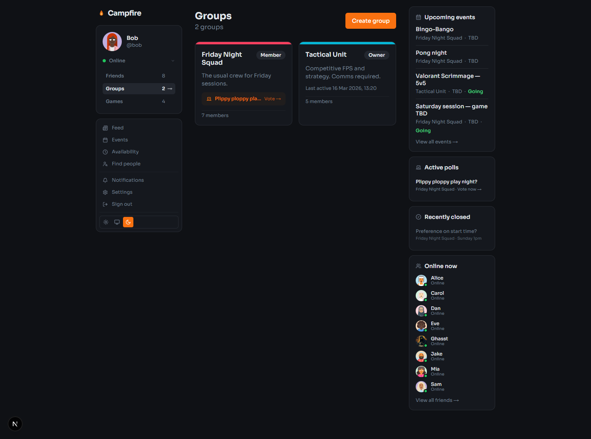

Groups are the core unit of Campfire. Each one is a private space for a specific crew — a regular Friday night squad, a competitive team, a tabletop group.

From the groups list you see each group's next session, any open polls waiting for your vote, and how many members are in it.

---

## Group Detail

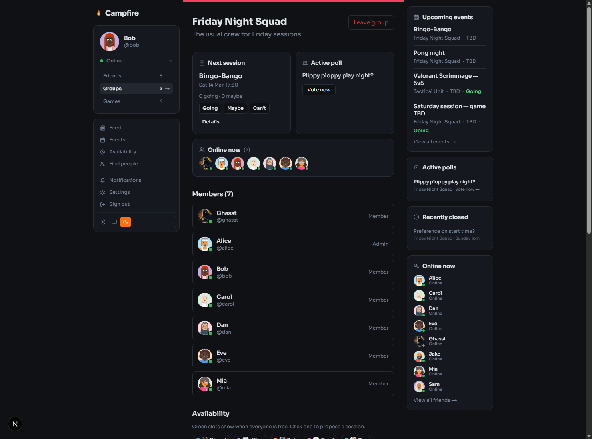

Opening a group gives you a command centre at the top: the next confirmed session with a one-click RSVP, the active poll, and who's online in the group right now. Below that you'll find the full member list, the availability overlap grid, and group management tools.

---

## Availability Overlap

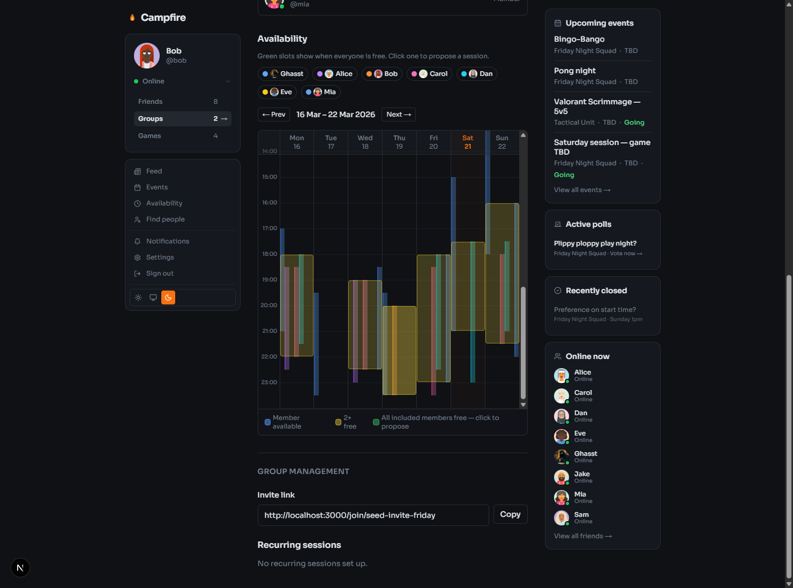

The availability calendar shows every member's free hours overlaid on a shared week view. Slots turn progressively brighter as more people are free at the same time — green means all included members are available. Click any green slot to jump straight to proposing a session at that time.

Use the member toggles at the top to filter which members are included in the overlap calculation, and use the week navigation arrows to look ahead.

---

## My Availability

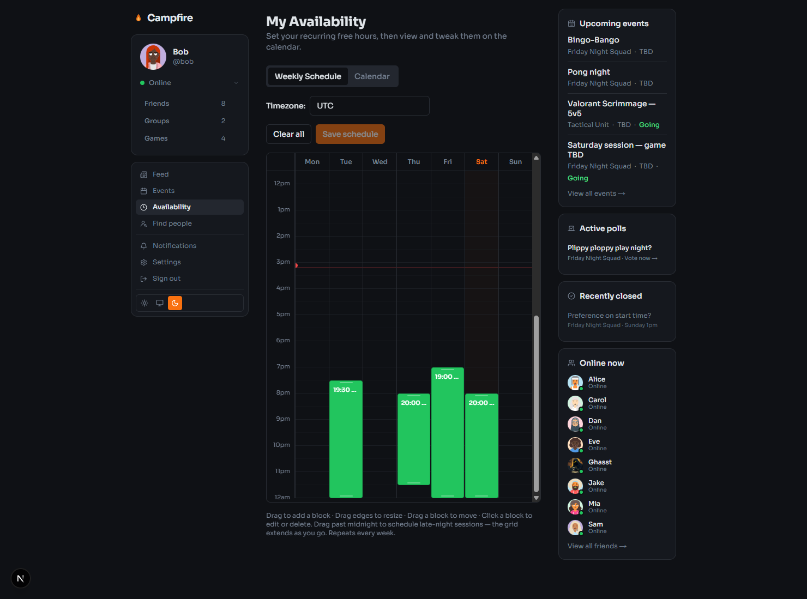

Set your recurring free hours on the weekly schedule — drag to create blocks, drag edges to resize, drag a block to move it, click to edit or delete. Blocks repeat every week automatically.

Drag a block past midnight if you play late-night sessions — the grid extends downward as you go, and collapses again after you release.

Switch to the **Calendar** tab to view a specific week and add one-off overrides when your schedule changes.

---

## Events

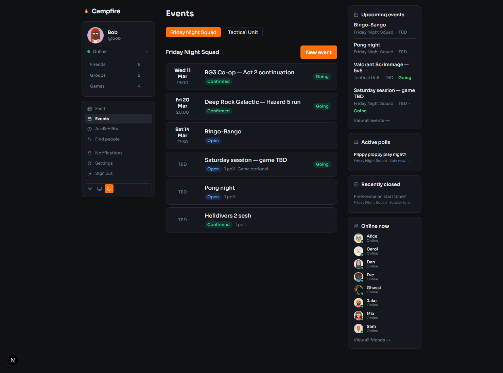

The events page lists all upcoming and past sessions across your groups, grouped by group with a tab strip to switch between them. Each row shows the date and time (or TBD), status badge, and whether you've RSVPed. Events with open polls are flagged inline.

---

## Event Detail

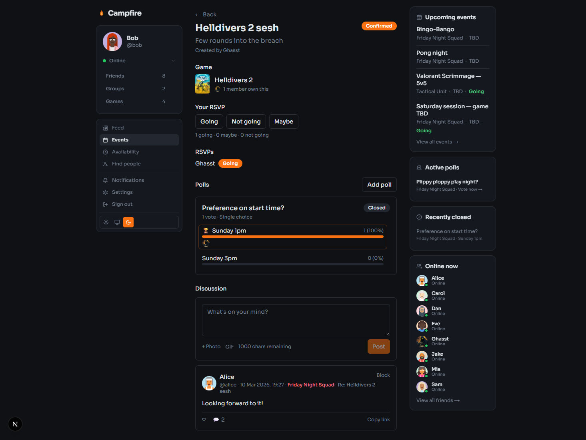

Every session has its own page with:

- **Game** — which game is being played, with cover art and an ownership count showing how many members already own it
- **Your RSVP** — Going / Not going / Maybe
- **RSVP list** — see who's in at a glance
- **Polls** — vote on time slots, games, or anything else; closed polls show the winning option with a trophy
- **Discussion** — a threaded post feed just for this event, so session chat stays out of the main feed

---

## Profile

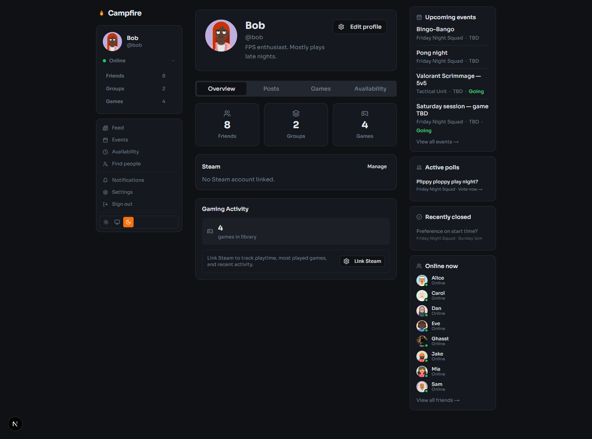

Your profile shows your display name, avatar, bio, and an at-a-glance summary of your friends, groups, and games library. There's a Steam integration section for linking your Steam account, which unlocks playtime and game library data.

Tabs let you browse your posts, games list, and availability schedule. You can view other people's profiles the same way — useful for checking whether a friend owns a game before planning a session.

---

## Games Library

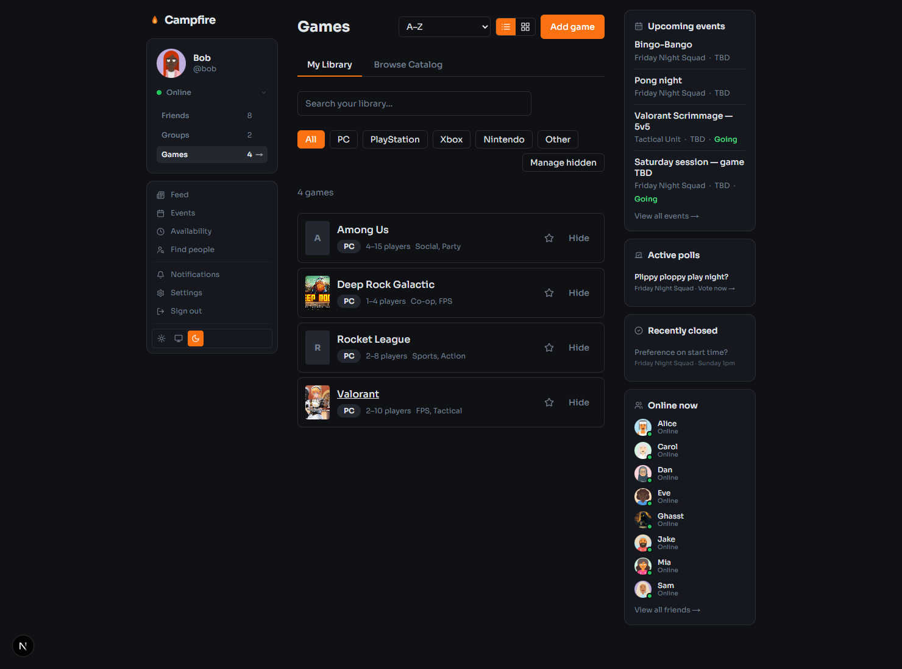

Keep a library of every game you own or want to play. Filter by platform, search by name, star favourites, and hide games you don't want cluttering the list.

The **Browse Catalog** tab lets you search across all games on Campfire and add them to your library in one click. Game cards show player count ranges and genre tags so you can quickly tell if a game fits the group.

When planning a session, Campfire shows ownership counts on event pages — so you know upfront whether everyone in the group already has the game.

---

## Friends

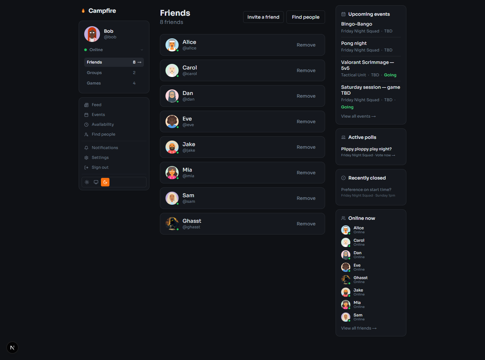

Your friends list shows everyone you're connected with and their current online status. Use the **Find people** button to search by username or display name, or **Invite a friend** to send them a link.

If you've linked Steam, Campfire will also surface any Steam friends who are already on the platform so you can connect with them automatically.

---

## Notifications

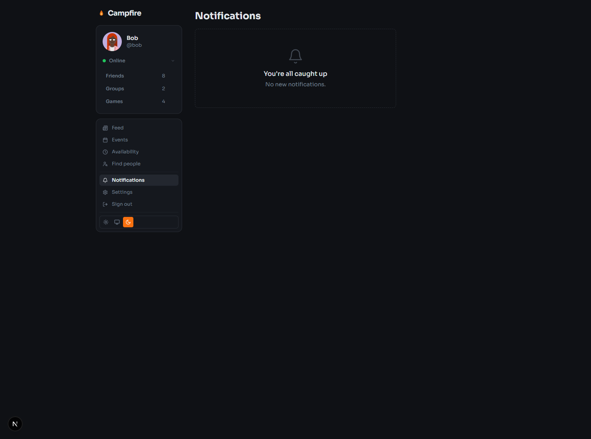

Campfire notifies you when something needs your attention — a friend request, a group invite, a like or comment on your post, or a new session proposed in one of your groups. Friend requests stay actionable (Accept / Decline) until you respond. Everything else is marked read automatically when you visit the page.

---

## Getting Started

1. **Create an account** and set your display name and avatar in Settings.
2. **Add friends** — search by username via Find People, or share an invite link.
3. **Create a group** (or accept an invite) for your regular crew.
4. **Set your availability** so the group overlap view knows when you're free.
5. **Add your games** to your library so others can see what you own.
6. **Propose a session** — pick a slot from the overlap view, set a game, and your group gets notified.
7. **Vote on polls** and RSVP — then show up and play.
